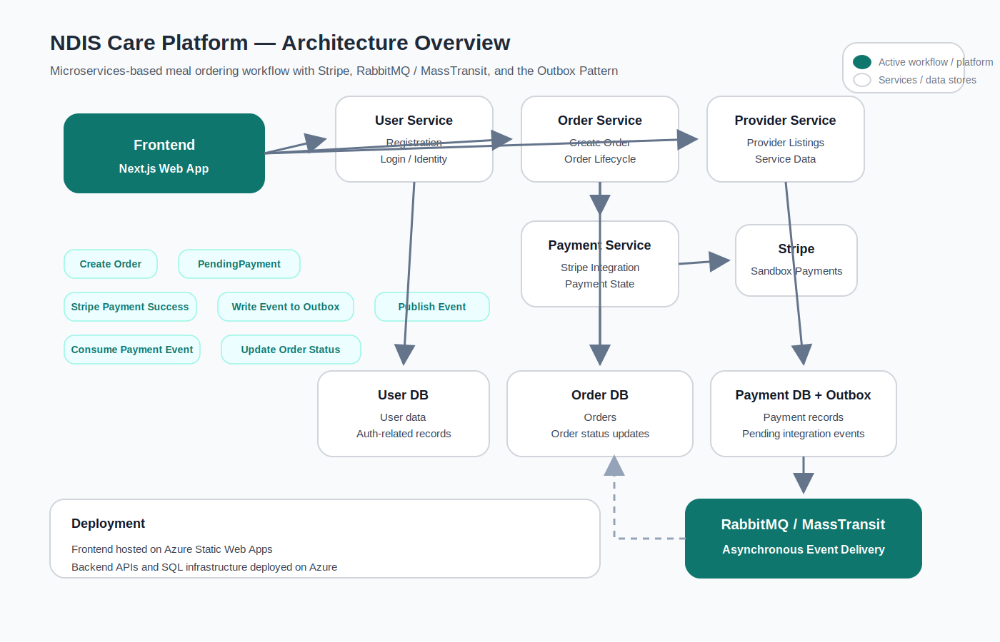

# NDIS Care Platform Backend

Backend services for the NDIS Care Platform, a full-stack demo project for NDIS meal ordering and service booking.

This repository focuses on backend service design, payment integration, asynchronous messaging, and reliable cross-service state synchronization.

## Related Repositories

- Frontend repository: https://github.com/JadeShi-1018/ndis-food-ordering-web

## Project Overview

This backend is designed around a realistic end-to-end workflow for NDIS meal ordering:

- users register and authenticate
- users browse services and providers through the frontend
- users create orders
- Payments are processed through Stripe sandbox integration
- order and payment states are synchronised across services

In addition to the functional workflow, the backend is built to demonstrate engineering concerns such as service boundaries, asynchronous communication, reliability, and architectural evolution from synchronous APIs to event-driven messaging.

## Architecture Summary

The system is split into multiple backend services with clear responsibilities:

- **User Service**  
  Handles user registration, login, and identity-related workflows.

- **Order Service**  
  Manages order creation, order lifecycle, and post-payment order status updates.

- **Payment Service**  
  Integrates with Stripe, manages payment state, and publishes payment-related events.

- **Provider Service**  
  Serves provider and service-related data consumed by the frontend.

- **RabbitMQ / MassTransit**  
  Supports asynchronous communication between services.

- **Outbox Pattern**  
  Improves reliability by persisting integration events before publishing them to the message broker.

## Architecture Diagram



## Core Order-Payment Workflow

1. A user creates an order from the frontend.
2. The Order Service stores the order with `PendingPayment` status.
3. The Payment Service handles Stripe payment confirmation.
4. A payment event is written to the Outbox.
5. The event is published to RabbitMQ.
6. The Order Service consumes the event asynchronously.
7. The order status is updated after payment succeeds.

This workflow is designed to demonstrate how payment state and order state can be coordinated across separate services while keeping service boundaries clear.

## Tech Stack

### Backend
- ASP.NET Core
- C#
- REST APIs

### Data & Messaging
- SQL Server / Azure SQL
- RabbitMQ
- MassTransit
- Outbox Pattern

### Integrations
- Stripe Sandbox

### Infrastructure
- Azure App Service
- Azure SQL

## Architecture Evolution

This project includes two implementation approaches.

### 1. Synchronous HTTP-based version

In the earlier version, services communicate through direct HTTP calls.

**Why this version was useful**
- simpler to implement initially
- easier to validate the business workflow end-to-end
- easier to debug during early development

### 2. Event-driven version with MQ and Outbox

In the evolved version, payment and order coordination are handled through RabbitMQ / MassTransit and the Outbox Pattern.

**Why this version matters**
- reduces tight coupling between services
- improves reliability for cross-service state synchronisation
- better represents distributed workflow handling in a microservices environment

The synchronous version helped validate the functional path first.  
The event-driven version is the architecture-focused evolution of the project.

## Key Engineering Decisions

### Why microservices

The project separates user, order, payment, and provider concerns into different services to demonstrate clearer service boundaries and domain ownership.

### Why asynchronous messaging

Payment completion and order updates are coordinated through events instead of direct synchronous callbacks, reducing service coupling.

### Why the Outbox Pattern

The Outbox Pattern helps prevent event loss when a database update succeeds, but message publishing fails.

### Why idempotency matters

Order and payment workflows need protection against retries, duplicate submissions, and repeated message delivery to reduce inconsistent state risks.

## Reliability Considerations

The backend design focuses on the following reliability concerns:

- separation of order state and payment state by service boundary
- asynchronous event publishing for cross-service updates
- Outbox-based event persistence before message dispatch
- idempotency-aware design for order and payment workflows
- retry-safe event consumption as a design goal

## Current Focus

The current architecture-focused work is completing the event-driven payment flow end-to-end:

- Stripe payment confirmation
- Outbox-based event persistence
- event publishing to RabbitMQ
- Order Service event consumption
- reliable order status synchronisation after payment succeeds

## Deployment

The backend services are intended to be deployed on Azure:

- backend APIs hosted on Azure App Service
- database hosted on Azure SQL
- frontend hosted separately on Azure Static Web Apps

## Running the Project

```bash
dotnet restore
dotnet build
dotnet run
